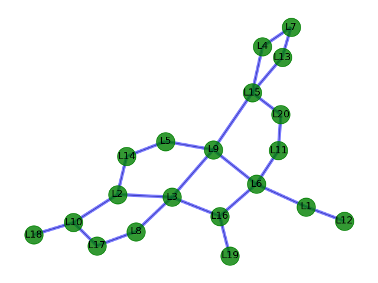
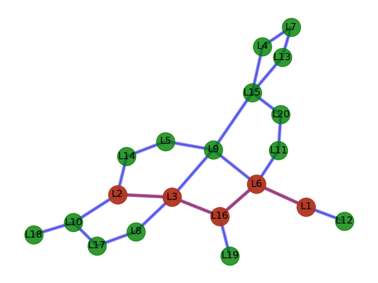

# optimal-path-Qlearning
The objective of this project is to find optimal path between any two nodes.
To achieve an optimal path in our project we used **Q- learning**, a model-free
reinforcement learning algorithm, aimed to learn the quality of actions and telling an
agent what action is to be taken under which circumstance. It does not require a model
of the environment (hence "model-free"), and it can handle problems with stochastic
transitions and rewards without requiring adaptations.

# visual representaion of nodes and location
Using the networkx library we designed the nodes and **matplotlib**.
**pyplot** is used to plot the nodes and edges

Suppose we want to find optimal path between *L1* and *L7*.
The output is ['L1', 'L6', 'L16', 'L3', 'L2'] which is shown in the figure below:

